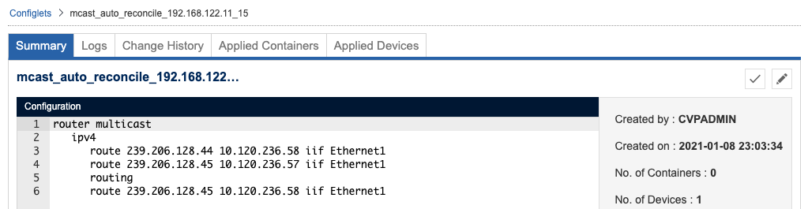
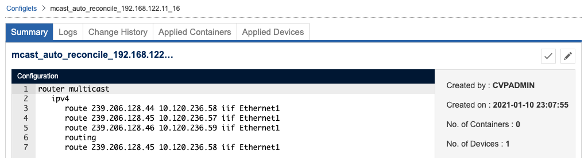

# CVP Multicast Auto Reconcile

<!-- TOC -->

- [CVP Multicast Auto Reconcile](#cvp-multicast-auto-reconcile)
  - [Overview](#overview)
  - [Components](#components)
    - [`mcast-auto-reconcile.py`](#mcast-auto-reconcilepy)
    - [`trigger-mcast-reconcile.py`](#trigger-mcast-reconcilepy)
    - [Custom TerminAttr with `-running_config_filter` option support](#custom-terminattr-with--running_config_filter-option-support)
  - [Example](#example)

<!-- /TOC -->

## Overview

CVP Multicast auto reconcile helps to add config produced by M&E controller (static multicast routes) to a generated configlet on Arista CloudVision Portal (CVP). With minor modification any other config changes that were made on a device directly can be reconciled as well.

## Components

### `mcast-auto-reconcile.py`

Must be used as a configlet builder on CVP and assigned to a parent container of a device group with a config that can be changed by M&E controller. This script simply contacts devices via eAPI (using CVP device class) and prints every line under `router multicast > ipv4`

### `trigger-mcast-reconcile.py`

Trigger reconcile configlet builder remotely via CVP REST API. Typically executed before running CVP Change Control task to avoid loosing config produced by M&E controller.  
The script will only update/create corresponding task on CVP if generated configlet content was changed or generated configlet was not created/assigned to a device yet.

> NOTE: A config produced by M&E controller after executing `trigger-mcast-reconcile.py` and before running CVP change control can be lost anyway. Keep this window short.

### Custom TerminAttr with `-running_config_filter` option support

`-running_config_filter` prevents streaming certain config lines to CVP to avoid blocking CVP Change Control in case of a device running config change. Please contact your SE to get the custom TerminAttr version with `-running_config_filter` support.  
The following example will prevent streaming of configured `239.x.x.x` routes to CVP:

```jinja
daemon TerminAttr   
   exec /usr/bin/TerminAttr -ingestgrpcurl={{cvp_ip}}:9910 -cvcompression=gzip -ingestauth=key,{{ingestauth_key}} -smashexcludes=ale,flexCounter,hardware,kni,pulse,strata -ingestexclude=/Sysdb/cell/1/agent,/Sysdb/cell/2/agent -ingestvrf={{ingestvrf}} -taillogs -running_config_filter=route[[:space:]]239
   no shutdown
```

> NOTE: As part of configuration will be hidden from CVP, the devices with the custom TerminAttr will be always out of compliance.

## Example

Generated configlet will be updated only in case of config change on a device.
For example, a new static route was configured below:

```diff
TEST#diff startup-config running-config
--- flash:/startup-config
+++ system:/running-config
@@ -44,6 +44,7 @@
       route 239.206.128.44 10.120.236.58 iif Ethernet1
       route 239.206.128.45 10.120.236.57 iif Ethernet1
       route 239.206.128.45 10.120.236.58 iif Ethernet1
+      route 239.206.128.46 10.120.236.59 iif Ethernet1
 !
 management api http-commands
    no shutdown
```

CVP is not aware of this configuration change, as it's not reflected in the generated configlet assigned to the device:



Execute `trigger-mcast-reconcile.py` to reconcile the change:

```bash
$ ./trigger-mcast-reconcile.py --cvp 192.168.122.221 -user cvpadmin
Password:
INFO:root:Connecting to https://192.168.122.221
INFO:root:Collecting device inventory.
INFO:root:Find configlets assigned to 00:0c:29:5c:a0:1a
INFO:root:Generating configlets from builder configletBuilderMapper_84f2fbbc-689b-4f27-b050-fa012e9e2c6e for devices ['00:0c:29:5c:a0:1a'] in container container_f86f2d3e-0839-4acb-a1cb-ac31ab6bfd33
INFO:root:A change was detected. mcast_auto_reconcile_192.168.122.11_15 will be replaced with mcast_auto_reconcile_192.168.122.11_16
INFO:root:Re-assigning configlets to 00:0c:29:5c:a0:1a
INFO:root:Adding temp actions and saving topology.
INFO:root:Deleting configlets that are no longer required.
```

The task will be created or updated to assign new generated configlet to the device.
Approve and execute change control.

The generated configlet with the new version prefix and updated content will be assigned to the device.


